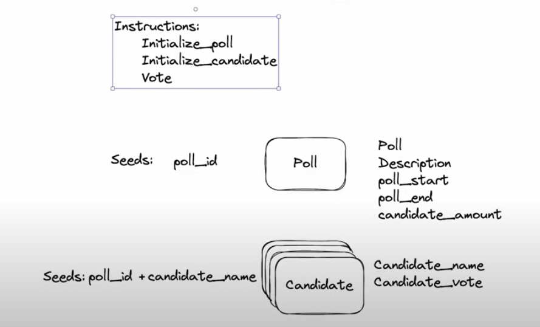

# Project



Para que esta mierda funcione ir a: `.cargo/registry/src/index.crates.io-1949cf8c6b5b557f/anchor-syn-0.31.0/src/idl/defined.rs`

modificar la puta linea **499** por esto:
`let source_path = proc_macro2::Span::call_site().file();`

con esto, la bosta esta arranca.

```sh
# versions

rustc 1.86.0 (05f9846f8 2025-03-31)
anchor-cli 0.31.0
solana-cli 2.1.21 (src:8a085eeb; feat:1416569292, client:Agave)
```